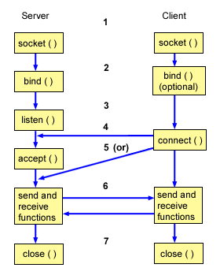

*This project has been created as part of the 42 curriculim by duandrad, gufreire and vloureir.*

# Description:
	The IRC project has the goal of creating an IRC Server from scratch using c++. It is supposed to follow IRC protocol standards and it is supposed to ne able to connect to an IRC Client, such as, hexchat to test its functionality.

	This project aims to develop knowledgeand experience with network programing, concurrency and client-server architecture in c++. This project aims to instruct how internet standards and protocols enable communication between diferent computers, and real-time messaging systems using TCP/IP communication. The basic implementation includes user authentication, channel creation and management, private messaging and handling various commands, such as, USER, NICK, KICK, TOPIC, JOIN. In this project there is no server-to-server communication, only client-to-server communication.

 ## IRC:
    IRC (Internet Relay Chat) is a text-based protocol designed for real time instant messaging through TCP/IP connections. It follows a client-server model with the server as its backbone and connection point to all the different clients and other servers, thus forming an IRC network.

 ## Sockets:
    Sockets are one of the common ways to handle server and client interactions. The client connects to server, exchanges information and then disconnects, this is a common way to use sockets.

    There is a typical flow of events when using sockets. In a connection-oriented client-to-server model, the socket on the server waits for requests through the clients socket. To be able to do this, the server first establishes (binds) an address for connections that the clients can use. When this is done, the server waits for requests from the client. The data exchange between the client to the server takes place when the client connects to server through a socket. Afterwards, the server performs the client's request and sends its reply back.

 ### Typical Flow of Events for connection-oriented socket:
   1. The socket() API creates an endpoint for communications and returns a socket descriptor that represents the endpoint.
   2. When an application has a socket descriptor, it can bind a unique name to the socket. Servers must bind a name to be accessible from the network.
   3. The listen() API indicates a willingness to accept client connection requests. When a listen() API is issued for a socket, that socket cannot actively initiate connection requests. The listen() API is     issued after a socket is allocated with a socket() API and the bind() API binds a name to the socket. A listen() API must be issued before an accept() API is issued.
   4. The client application uses a connect() API on a stream socket to establish a connection to the server.
   5. The server application uses the accept() API to accept a client connection request. The server must issue the bind() and listen() APIs successfully before it can issue an accept() API.
   6. When a connection is established between stream sockets (between client and server), you can use any of the socket API data transfer APIs. Clients and servers have many data transfer APIs from which to choose, such as send(), recv(), read(), write(), and others.
   7. When a server or client wants to stop operations, it issues a close() API to release any system resources acquired by the socket.
    

  Here's a visual representation of the flow of events: 
  

*Source: [How sockets work, IBM Documentation](https://www.ibm.com/docs/en/i/7.4.0?topic=programming-how-sockets-work)*
    

# Instruction:
   ## To start the Server:
	./ircserver <port> <password>
	
   ## To connect with nc:
	nc -C <server ip> <port>
	PASS <pasword>
	NICK <nickname>
	USER <username>
	
   ## To connect with Hexchat:
	ADD networks

	EDIT the created network
		edit the ip/port to the server ip and port
		select the 1st(Connect to selected server only) and 5th(Accept invalid SSL certificates) boxes
		Choose Nick name
		Choose Real name
		Choose User name
		Login method is Server password
		Input the correct password
		Character set is UTF-8(Unicode)

	Connect to created network

   ## Commands

  - **KICK:** to remove a user from a channel

      - **EXAMPLE:**  /kick ***channel user***

  - **INVITE:** to invite a user to a channel

      - **EXAMPLE:** #INVITE ***user channel***

  - **TOPIC:** to change or view the channel TOPIC

      - **EXAMPLE:** #TOPIC ***channel :new topic***

  - **MODE:** to set modes

    +/-i -> to set/remove Invite ONLY channel mode

    +/-t -> to set/remove TOPIC to channel operators

    +/-k -> to set/remove channel password requirement

    +/-o -> to give channel operator privilege to a user

    +/-l -> to set/remove user limit on a channel

      - **EXAMPLE:** #MODE +-+ikl 10 ***user channel***

# Resources:
   ## Articles:

   [IRC Protocol 1459](https://www.rfc-editor.org/info/rfc1459/)

   [IRC Protocol 2812](https://www.rfc-editor.org/info/rfc2812/)

   [IBM Socket Documentation](https://www.ibm.com/docs/en/i/7.4.0?topic=programming-how-sockets-work)

   [Modern IRC Protocol](https://modern.ircdocs.horse)

   [Simplified IRC Implementation Video](https://www.youtube.com/watch?v=dquxuXeZXgo&start=0)